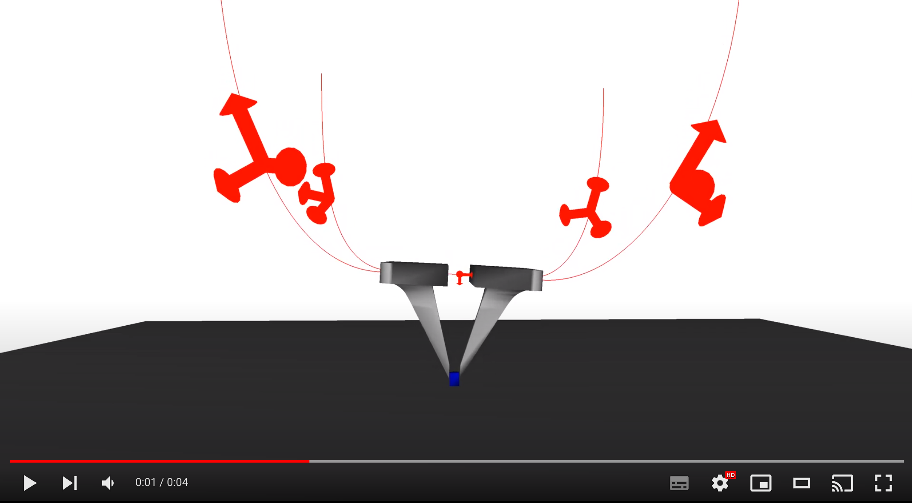

# Micro Parallel

[](https://www.youtube.com/watch?v=Rd6-Uzwjwx4)

## Installation

### Required 

The simulations are done using the simulation framework [SOFA](https://www.sofa-framework.org/). Binaries of SOFA with the required and optional plugins are available [here](https://github.com/SofaDefrost/TIRREX/releases). If you compile SOFA, checkout the following source code:

- [SOFA](https://github.com/sofa-framework/sofa) on branch master
- [SofaPython3](https://github.com/sofa-framework/SofaPython3) plugin for SOFA on branch master 
- [BeamAdapter](https://github.com/sofa-framework/BeamAdapter) plugin on branch master 
- [SoftRobots](https://github.com/SofaDefrost/SoftRobots) plugin on branch master 
- [STLIB](https://github.com/SofaDefrost/STLIB) plugin on branch master

### Optional 

- [SoftRobots.Inverse](https://github.com/SofaDefrost/SoftRobots.Inverse) plugin for SOFA to solve the inverse kinematics of the robot
- [ROS2](https://docs.ros.org/en/humble/Installation.html) to send commands to the robot from an external program (last tested with ROS2 Humble)

## How to


1. Run the simulation. In your terminal:
```bash
~$ cd TIRREX.MicroParallel
~/TIRREX.MicroParallel$ runSofa scene.py
~/TIRREX.MicroParallel$ runSofa sceneInverseKinematics.py  # for inverse resolution
```
2. To use ROS2, first source it in your terminal. For instance:
```bash
~/TIRREX.MicroParallel$ source /opt/ros/humble/setup.bash
```

To enable ROS, uncomment the following line in file `scene.py`:

```python
# Uncomment these lines to enable ROS communication
from controller import SofaROSInterface
rootnode.addObject(SofaROSInterface(robot.node))
```

## Features


### Parameters

The geometric and mechanical parameters of the robot can be changed from the file `params.py`.

### ROS

Two topics are created on the node *SOFASimulation*:
- the topic */TIRREX/microparallel/simulationData*, on which the actual dofs values are being published at each time step of the simulation
- and the topic */TIRREX/microparallel/interfaceData*, on which the simulation is subscribing and looking for commands

The simulation expects the following commands (see file `controller.py`):

```python
# A list of 4 elements
[ q0, # leg0 displacement in mm
  q1, # leg1 displacement in mm
  q2, # leg2 displacement in mm
  q3, # leg3 displacement in mm
]
```

## Authors


Eulalie Coevoet & Mohamed Chakroune
